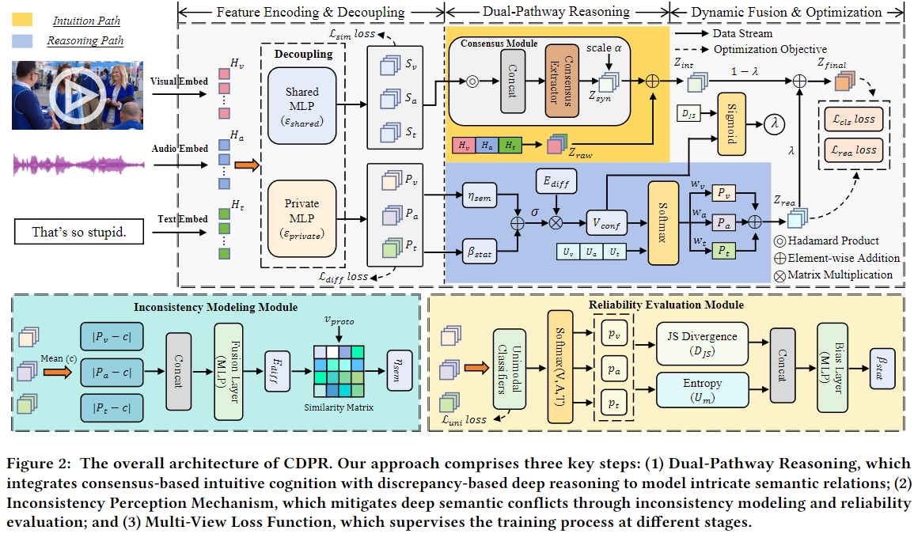
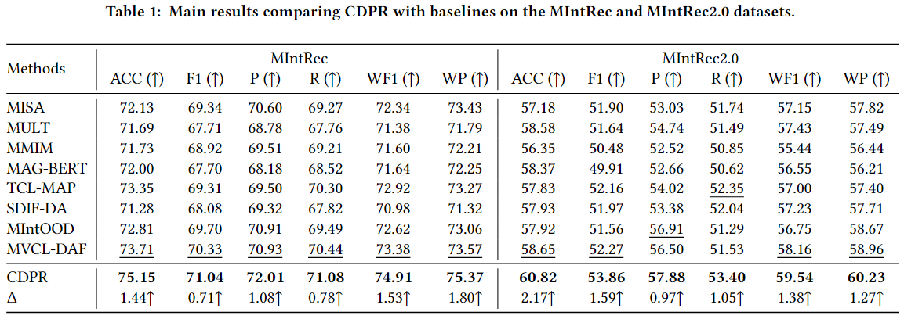

# Mitigating Multimodal Inconsistency via Cognitive Dual-Pathway Reasoning for Intent Recognition

This repository provides the official PyTorch implementation of the research paper:

 [Mitigating Multimodal Inconsistency via Cognitive Dual-Pathway Reasoning for Intent Recognition] (**Accepted by ICMR 2026 Long Paper**).

## 1. Introduction
Multimodal Intent Recognition is vital for analyzing human intentions through text, video, and audio signals. However, existing methods struggle to distinguish consistent and inconsistent cues and fail to model semantic conflicts. To address these challenges, this paper proposes a novel CDPR method, which employs cognitive dual-pathway reasoning framework to establish a stable semantic foundation and mitigate high-level inconsistencies jointly, achieving deep multimodal semantic understanding.

## 2. Dependencies
We use anaconda to create python environment and install required libraries:

```
cd CDPR
conda create --name cdpr python=3.9
conda install pytorch==1.13.1 torchvision==0.14.1 torchaudio==0.13.1 pytorch-cuda=11.7 -c pytorch -c nvidia
pip install -r requirements.txt
```

## 3. Usage
The data can be downloaded through the following links:

```
https://drive.google.com/drive/folders/1nCkhkz72F6ucseB73XVbqCaDG-pjhpSS
```

You can evaluate the performance of our proposed CDPR on [MIntRec](https://dl.acm.org/doi/epdf/10.1145/3503161.3547906) and [MIntRec2.0](https://proceedings.iclr.cc/paper_files/paper/2024/file/ca97c1a8c52889c49e16497912244c3b-Paper-Conference.pdf) by using the following commands:

- MIntRec

```
sh examples/run_cdpr_mintrec.sh
```

- MIntRec2.0

```
sh examples/run_cdpr_mintrec2.sh
```

You are required to configure the path to the pre-trained model in the `configs/__init__.py` file and the data path in `run.py`.

## 4. Model



## 5. Experimental Results


## 6. Acknowledgments
Some of the codes in this repo are adapted from [MIntRec](https://github.com/thuiar/MIntRec/tree/main), and we are greatly thankful.

If you have any questions, please open issues and illustrate your problems as detailed as possible.